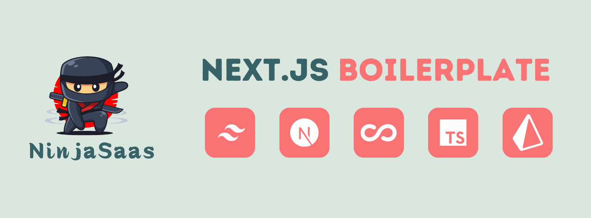

# Next.js Boilerplate

A robust and feature-rich Next.js boilerplate for quickly bootstrapping your web applications.

## Table of Contents

- [Features](#features)
- [Tech Stack](#tech-stack)
- [Getting Started](#getting-started)
  - [Prerequisites](#prerequisites)
  - [Installation](#installation)
- [Environment Variables](#environment-variables)
- [Available Scripts](#available-scripts)
- [Database Management](#database-management)
- [Testing](#testing)
- [Storybook](#storybook)
- [Deployment](#deployment)
- [Contributing](#contributing)
- [Security](#security)
- [License](#license)
- [Contact](#contact)

## Features

- 🔐 Secure user authentication and authorization
- 👤 User profiles
- 💬 Real-time chat functionality
- 📊 Data visualization components
- 📚 Multi-language support
- 🔒 End-to-end encryption setup
- 📱 Responsive design
- 📅 Calendar integration with FullCalendar

## Tech Stack

- **Frontend:** Next.js, React, TypeScript
- **Styling:** Tailwind CSS, Sass
- **State Management:** Zustand, React Query
- **Backend:** Supabase, Prisma
- **Authentication:** Supabase Auth
- **Database:** Supabase (PostgreSQL)
- **API:** tRPC
- **Forms:** React Hook Form, Yup
- **Internationalization:** next-intl
- **UI Components:** Radix UI, Headless UI
- **Testing:** Jest, Playwright
- **Code Quality:** ESLint, Prettier
- **Documentation:** Storybook

## Getting Started

### Prerequisites

- Node.js (v18.19.0 or later)
- pnpm (v8.8.0 or later)
- Git

### Installation

1. Use this template to create a new repository
2. Clone your new repository:
   git clone https://github.com/ninjasaas/nextjs-boilerplate.git
   cd nextjs-boilerplate
3. Install dependencies:
   pnpm install
4. Set up environment variables (see [Environment Variables](#environment-variables) section)

## Environment Variables

Create a `.env.local` file in the root directory and add the necessary environment variables. Refer to the `.env.gmail` file for the required variables.

## Available Scripts

- `pnpm dev`: Run the development server
- `pnpm build`: Build the production application
- `pnpm start`: Start the production server
- `pnpm lint`: Run ESLint
- `pnpm format`: Run Prettier
- `pnpm test`: Run Jest tests
- `pnpm e2e:headless`: Run Playwright tests headless
- `pnpm e2e:ui`: Run Playwright tests with UI
- `pnpm storybook`: Start Storybook development server
- `pnpm build-storybook`: Build Storybook for production

For a full list of available scripts, refer to the `scripts` section in the `package.json` file.

## Database Management

- `pnpm db:dev`: Run Prisma migrations in development
- `pnpm db:generate`: Generate Prisma client
- `pnpm db:push`: Push schema changes to the database
- `pnpm db:studio`: Open Prisma Studio

## Testing

- Unit and Integration Tests: `pnpm test`
- End-to-End Tests: `pnpm e2e:headless` or `pnpm e2e:ui`
- Storybook Tests: `pnpm e2e:test-storybook`

## Storybook

Run `pnpm storybook` to start the Storybook development server and view component documentation.

## Deployment

The application is set up for deployment on Vercel. Connect your GitHub repository to Vercel for automatic deployments on every push to the main branch.

## Contributing

Contributions are welcome! Please feel free to submit a Pull Request.

## Security

If you discover any security-related issues, please email [contact.mindrested@gmail.com](mailto:contact.mindrested@gmail.com) instead of using the issue tracker.

## License

This project is open-sourced software licensed under the [MIT license](https://opensource.org/licenses/MIT).

## Contact

For any queries, please reach out to:

- **Author:** Mouad Louhichi
- **Email:** contact.mindrested@gmail.com
- **GitHub:** [https://github.com/ninjasaas/nextjs-boilerplate](https://github.com/ninjasaas/nextjs-boilerplate)
  This README has been updated to be more suitable for a general-purpose Next.js boilerplate template. Key changes include:

Updated the title and description to reflect a boilerplate template.
Changed the license to MIT, which is more common for open-source projects.
Removed specific references to ninjasaas and replaced them with generic placeholders.
Updated the installation instructions to use the template.
Simplified the Features section to highlight general capabilities.
Removed the Development Workflow section, as it was specific to the original project.
Updated the Contributing section to be more open to contributions.
Modified the Contact section with placeholder information.
